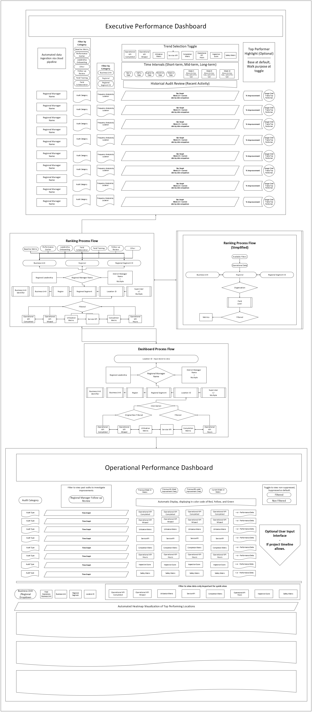

# Enterprise Reporting Workflow Redesign (Case Study)

## Overview
This project presents a sanitized case study of redesigning a reporting workflow in a large-scale retail environment supporting approximately 2,300+ locations. 

The original process relied on a manually maintained spreadsheet with no validation, access control, or redundancy, creating operational risk and inefficiencies.

---

## Problem

- Manual reporting process requiring 16+ hours per week  
- No data validation, causing potential inaccuracies  
- Single-source dependency (high failure risk)  
- No access control or data governance structure  
- Limited scalability across enterprise operations  

---

## Objective

- Replace manual workflow with automated pipeline  
- Improve data accuracy and reliability  
- Enable scalable reporting across thousands of locations  
- Support faster and more confident decision-making  

---

## Approach

### 1. Workflow Analysis
- Mapped existing reporting process  
- Identified key failure points and risks  

### 2. Data Architecture Design
- Designed a cloud-based pipeline structure  
- Created separation between ingestion, transformation, and reporting layers  

### 3. Data Validation
- Introduced structured logic to improve data accuracy  
- Reduced dependency on manual processes  

### 4. Reporting Design
- Built dashboard structure for multiple stakeholder levels  
- Focused on usability and decision support  

---

## Architecture

This architecture reflects a transition from manual reporting to a scalable, automated analytics workflow supporting enterprise-level decision-making.

For a detailed view of the full diagram:

- architecture.pdf

---

## Outcome

- Eliminated reliance on a manual reporting file  
- Reduced 16+ hours of weekly manual effort  
- Improved data reliability and validation  
- Enabled scalable reporting across ~2,300+ locations  
- Supported more efficient operational decision-making  

---

## Tools & Technologies

- SQL  
- Cloud Data Warehouse (BigQuery-type architecture)  
- Tableau  
- Excel  

---

## Notes

This project is a sanitized representation of an enterprise analytics solution. All proprietary data, system names, and internal identifiers have been removed.
